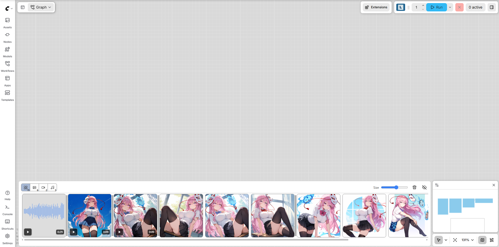
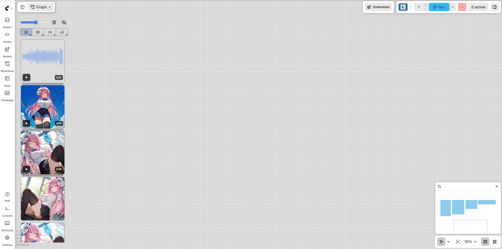
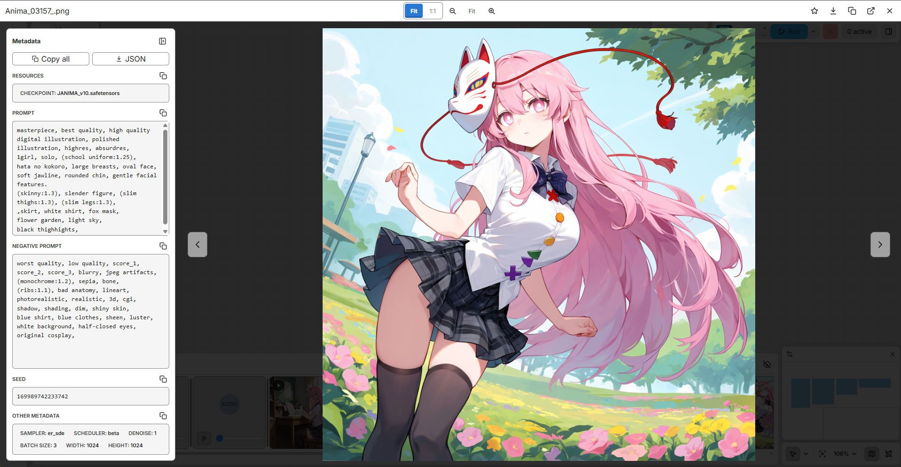

# Media Feed for ComfyUI

**A media feed for ComfyUI that shows your generated images, videos, and audio right inside the canvas.**

Browse recent outputs, inspect metadata, compare generations, and save favorites without opening the output folder.

## Preview

<p>
  
  
  
</p>

Generated media appears in a fixed panel on the chosen edge of the canvas.

## Key Features

- **All your generated media in one feed** — Browse images, videos, and audio
  directly inside ComfyUI.
- **Batch view** — Group the outputs of one queued generation into a grid card
  and compare whole batches side by side.
- **Full-screen media viewer** — Inspect images with zoom and pan, play videos
  and audio, and navigate between outputs.
- **Generation metadata at a glance** — View and copy embedded prompts, seeds,
  model details, and other available generation settings.
- **One-click favorites** — Save copies of your favorite outputs to
  `output/favorites` with the star button.
- **A feed that fits your workspace** — Choose its canvas edge, resize
  thumbnails, and automatically follow new generations.

## Detailed Features

- Shows newly generated images, videos, and audio in one feed, with filters for
  each media type. The **All** filter is labeled in the toolbar, next to a
  separate grid button that toggles batch view.
- Batch view groups media sharing a prompt ID. A feed card previews up to four
  outputs in a 2×2 grid and shows a remaining count when there are more. The
  viewer shows every output in a grid of uniform square cells that can be
  zoomed and panned as one view.
  Batch zoom is relative to the fitted grid; the 1:1 control is
  reserved for individual media. The choice is saved across reloads.
- Click a batch cell to select an output for favorites, download, image copy,
  opening the original, and metadata. A thin frame occupies reserved space
  around the media and stays two screen pixels wide while zooming. The first
  output starts selected; new outputs preserve the current selection. Each
  comparison pane has its own selection. Cells can also be focused with Tab
  and selected with Enter. Dragging pans without selecting; double-clicking
  an image still zooms the whole grid. Dragging over a video's picture pans
  without starting playback, while its controls remain usable. Each audio
  cell places a landscape detailed waveform above the same timeline, seeking,
  and volume controls as the single-item viewer. Batch-card audio
  previews use the compact waveform and remaining-time display from individual
  feed thumbnails. Both types select their media item when playback starts;
  selection itself does not start or stop playback. Space pauses playing media
  in the focused pane, or starts its selected video/audio when nothing is
  playing; focused player controls keep
  their native keyboard behavior.
- Compares images, videos, and audio side by side: the compare button pins the
  current item on the right while navigation continues on the left. Each pane
  has its own filename, favorites, download, and viewing controls in one header
  row. On narrow panes, additional controls are available from the **…** menu.
  Zoom and pan stay synchronized during comparison. Playback
  is independent, and the pinned video/audio starts paused. Press compare again
  to return to the left item in the normal viewer. Each side has its own
  metadata panel that can be shown or hidden independently; the left metadata
  follows navigation while the right metadata stays pinned. In batch view, the
  left grid navigates between batches and the right grid pins a batch.
- Opens media in an overlay viewer, with actions to download or open the
  original file.
- Copies output media to `output/favorites` from the star button in the viewer
  or on a hovered feed card.
- Supports previous/next navigation with side buttons, arrow keys, and wheel
  scrolling in the viewer.
- Plays video thumbnails muted on hover, enables their audio from the thumbnail
  play button, and lets video and audio looping be configured independently.
- Toggles video or audio playback with the Space key while the viewer is open.
- Shows a compact, single-color waveform and duration/remaining time on audio
  thumbnails. The viewer expands this into a detailed waveform with seeking and
  a playhead that follows the current playback position.
- Counts down the remaining time on playing video and audio thumbnails.
- Stops thumbnail audio and returns it to the beginning when the pointer leaves
  its card.
- Lets you resize thumbnails, jump to the newest or oldest item, and clear the
  current feed from the toolbar.
- Can automatically follow newly generated media.
- Can show media from every workflow tab or only media queued from the current
  workflow tab.
- Can visually separate media from different queued generations with a subtle,
  theme-aware divider.
- Adds ComfyUI settings for placing the feed at the top, right, bottom, or left
  of the canvas.
- Localizes Media Feed settings in English, Japanese, Simplified and Traditional
  Chinese, Korean, French, and German, following ComfyUI's selected language
  when that locale is available in the frontend.
- Reads embedded metadata in the viewer and displays inferred positive and
  negative prompts, seeds, model resources such as checkpoints and LoRAs, and
  other available generation details.
- Lets you copy prompts, seeds, resource and generation-detail sections, or all
  displayed metadata with visual copy confirmation.
- Downloads all embedded JSON metadata as a formatted `.json` file.
- Lets you place the metadata panel on either side of the viewer.
- Provides Fit, actual-size, and zoom controls for images and videos. Zoomed
  images and videos can be panned by dragging, and double-clicking zooms in
  or returns to the selected Fit/actual-size view. The Fit scale can be adjusted
  from 25% to 100% of the available viewer area. The zoom percentage always
  shows the displayed size relative to the media's original dimensions.
- Uses ComfyUI theme colors when available.
- Saves feed and viewer settings in browser `localStorage`.
- Restores the latest feed after a page reload in the same browser tab.
- Keeps the feed responsive by limiting retained items and virtualizing visible
  cards.

## Settings Defaults

- Placement: `Bottom`
- Thumbnail size: `143px` high
- Follow latest media: `On`
- Feed history limit: `256`
- Feed style: `Default`
- Media from: `All workflow tabs`
- Exclude Preview node media: `Off`
- Batch dividers: `Line`
- Show metadata in viewer: `On`
- Metadata position: `Left`
- Fit media to viewer: `Off`
- Fit scale: `100%`
- Loop videos: `On`
- Loop audio: `Off`
- Show ComfyUI progress panel over viewer: `Off`
- Show favorite button on hover: `On`
- Favorite storage folder: `output/favorites` (fixed)

Saved settings are stored in browser `localStorage` and override these defaults
after the first change.

Enable **Show ComfyUI progress panel over viewer** to keep ComfyUI's standard
progress panel visible and usable while viewing media. Its position and
expanded/collapsed state follow ComfyUI. Closing the viewer or disabling the
option restores the usual layering. This option requires a frontend with the
standard progress overlay enabled; it does not create a panel on versions that
do not provide one. With metadata on the right, the viewer keeps a stable space
between the Metadata heading and its action buttons, using a slightly smaller
Negative Prompt area so generation start and completion do not shift controls.

## Performance Notes

The feed keeps the configured number of latest media entries in memory (256 by
default, selectable from 64 to 1024), mirrors only their small file descriptors
to browser `sessionStorage`, and only renders visible cards plus a small overscan
buffer. Media files themselves are never copied into browser storage. The
toolbar trash button clears both the visible feed and its saved session entries.

Images, videos, and audio are loaded through ComfyUI's standard `/view` route.
Image thumbnails and the full-screen image viewer use the same URL so the browser
can reuse cache. Recently decoded images are also kept in a small in-memory LRU
cache.

Video thumbnails use `preload="metadata"`. The native audio element uses
`preload="none"` until playback, while visible audio cards load the same `/view`
URL one at a time to derive a small waveform. Only the reduced waveform levels
are cached after decoding.

## Install

#### ComfyUI Manager

Search for **Media Feed** in ComfyUI Manager and install it.

#### Manual

For manual installation, clone this repository into `ComfyUI/custom_nodes`:

```bash
cd ComfyUI/custom_nodes
git clone https://github.com/pajama114/ComfyUI-Media-Feed.git
```

Restart ComfyUI and reload the browser.

If the extension loads correctly, the browser developer console will show:

```text
[ComfyUI Media Feed] extension loaded
```

## Supported Media

The feed listens for ComfyUI `executed` events and recursively searches node
outputs for objects shaped like this:

```json
{
  "filename": "ComfyUI_00001_.png",
  "subfolder": "",
  "type": "output"
}
```

Media type is detected from the filename extension.

When **Exclude Preview node media** is enabled, media emitted by nodes whose
type starts with `Preview` (for example, `Preview Image`) is not added to the
feed.

Images:

```text
avif, bmp, gif, jpeg, jpg, png, webp
```

Videos:

```text
avi, m4v, mkv, mov, mp4, webm
```

Audio:

```text
aac, flShow metadata in viewers, wav
```

## Embedded Metadata

When **Show prompts in viewer** is enabled, Media Feed fetches the selected
file and reads its embedded metadata. It attempts to recover prompts, seeds,
and generation details from ComfyUI prompt/workflow data, including data inside
subgraphs. When available, the viewer also lists the checkpoint and active LoRA
resources used by the workflow.

Embedded metadata reading is supported for:

```text
PNG, GIF, MP4, M4V, MOV, WebM, MKV, M4A, MP3, FLAC, OGG, Opus
```

For larger media, Media Feed first scans small byte ranges instead of loading
the entire file. Video scans include both the beginning and end of the file,
where container metadata is commonly stored. If that initial scan cannot find
the embedded metadata, the viewer offers a **Read full file metadata** action
to complete a full scan on demand.

## Favorites

Selecting the star copies output media (images, video, or audio) to the fixed
`favorites` folder inside ComfyUI's configured output directory. The folder is
created on first use. Source media is never moved, deleted, or overwritten; a
number is appended when a favorite already has the same filename. Selecting a
registered star again removes that specific copied file from `favorites`; it
never removes the source media. Media from `input` or `temp` is not eligible,
so this feature never accepts an arbitrary filesystem path.

The **Favorite storage folder** setting displays the fixed relative path
`output/favorites`; it is informational and cannot be changed.

## Current Limitations

- The feed does not scan existing files in the output directory. It restores
  media seen in the current browser-tab session after a reload, but closing the
  tab starts a new feed session.
- Video and audio support depends on output nodes returning `filename`,
  `subfolder`, and `type` in their execution payload.
- The extension uses ComfyUI's local `/view` route. Remote or hosted setups may
  need additional adapter work.
- Metadata display depends on the output file containing supported embedded
  metadata. Custom nodes and workflows may use formats that cannot be read, or
  may not expose enough information to infer every prompt, seed, resource, or
  generation parameter.

## Development

ComfyUI loads JavaScript files from `WEB_DIRECTORY`, exported in `__init__.py`.
The frontend is split into small browser modules:

```text
web/js/media_feed.js
web/js/metadata.js
web/js/metadata_parsers.js
web/js/styles.js
web/js/icons.js
```

There are no runtime Python dependencies.
