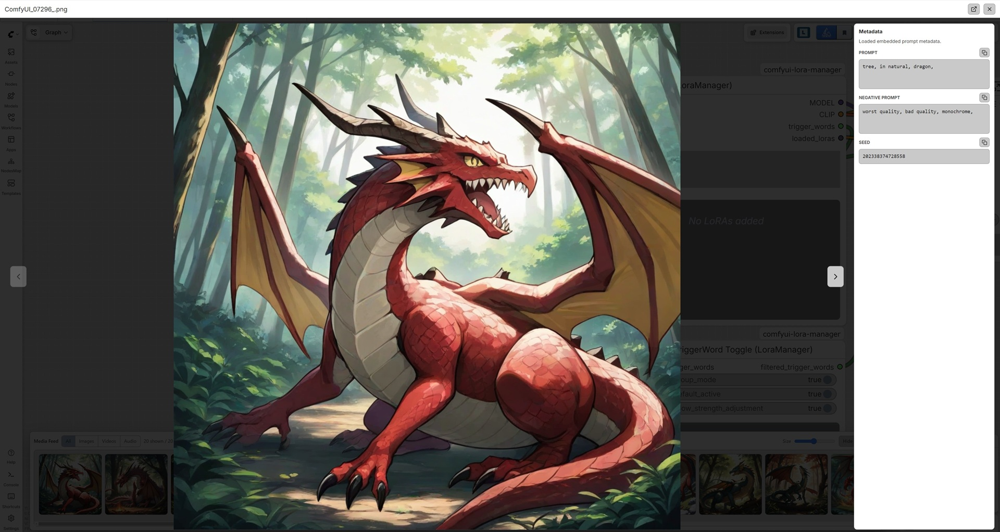

# Media Feed for ComfyUI

Media Feed adds a lightweight, in-session browser for generated images, videos,
and audio in ComfyUI.

## Preview

<p>
  
  
</p>

Generated media appears in a bottom-panel tab when the ComfyUI frontend supports
bottom-panel tabs. On older frontends, or when another placement is selected,
Media Feed uses a fixed panel on the chosen edge of the canvas.

## Features

- Shows newly generated images, videos, and audio in one feed, with filters for
  each media type.
- Opens media in an overlay viewer, with a link to open the original file.
- Supports previous/next navigation with side buttons, arrow keys, and wheel
  scrolling in the viewer.
- Plays video thumbnails on hover, muted and looped.
- Provides compact audio thumbnail controls with a full-width seek bar.
- Lets you resize thumbnails, jump to the newest or oldest item, and clear the
  current feed from the toolbar.
- Can automatically follow newly generated media.
- Adds ComfyUI settings for placing the feed at the top, right, bottom, or left
  of the canvas.
- Reads embedded metadata in the viewer and displays inferred positive and
  negative prompts, seeds, model resources such as checkpoints and LoRAs, and
  other available generation details.
- Lets you copy the displayed prompt, negative prompt, or seed with one click.
- Lets you place the metadata panel on either side of the viewer.
- Can fit small images and videos to the largest size that remains fully visible
  in the viewer.
- Uses ComfyUI theme colors when available.
- Saves feed and viewer settings in browser `localStorage`.
- Keeps the feed responsive by limiting retained items and virtualizing visible
  cards.

## Settings Defaults

- Placement: `Bottom`
- Thumbnail size: `143px` high
- Follow latest media: `On`
- Show metadata in vieweredia: `Off`
- Show prompts in viewer: `On`
- Metadata position: `Left`
- Fit media to viewer: `Off`

Saved settings are stored in browser `localStorage` and override these defaults
after the first change.

## Performance Notes

The feed keeps the latest 256 media entries in memory and only renders visible
cards plus a small overscan buffer.

Images, videos, and audio are loaded through ComfyUI's standard `/view` route.
Image thumbnails and the full-screen image viewer use the same URL so the browser
can reuse cache. Recently decoded images are also kept in a small in-memory LRU
cache.

Video thumbnails use `preload="metadata"`. Audio thumbnails use `preload="none"`
until the user presses play.

## Install

Install through ComfyUI Manager once this extension is published.

For manual installation, clone this repository into `ComfyUI/custom_nodes`:

```bash
cd ComfyUI/custom_nodes
git clone https://github.com/pajama114/ComfyUI-Media-Feed.git
```

Restart ComfyUI and reload the browser.

If the extension loads correctly, the browser developer console will show:

```text
[ComfyUI Media Feed] extension loaded
```

## Supported Media

The feed listens for ComfyUI `executed` events and recursively searches node
outputs for objects shaped like this:

```json
{
  "filename": "ComfyUI_00001_.png",
  "subfolder": "",
  "type": "output"
}
```

Media type is detected from the filename extension.

When **Exclude Preview node media** is enabled, media emitted by nodes whose
type starts with `Preview` (for example, `Preview Image`) is not added to the
feed.

Images:

```text
avif, bmp, gif, jpeg, jpg, png, webp
```

Videos:

```text
avi, m4v, mkv, mov, mp4, webm
```

Audio:

```text
aac, flShow metadata in viewers, wav
```

## Embedded Metadata

When **Show prompts in viewer** is enabled, Media Feed fetches the selected
file and reads its embedded metadata. It attempts to recover prompts, seeds,
and generation details from ComfyUI prompt/workflow data, including data inside
subgraphs. When available, the viewer also lists the checkpoint and active LoRA
resources used by the workflow.

Embedded metadata reading is supported for:

```text
PNG, GIF, MP4, M4V, MOV, WebM, MKV, M4A, MP3, FLAC, OGG, Opus
```

For larger media, Media Feed first scans small byte ranges instead of loading
the entire file. Video scans include both the beginning and end of the file,
where container metadata is commonly stored. If that initial scan cannot find
the embedded metadata, the viewer offers a **Read full file metadata** action
to complete a full scan on demand. The extension does not alter media files; it
only reads metadata that is already present.

## Current Limitations

- The feed only shows media generated while the page is open. It does not scan
  existing files in the output directory.
- Video and audio support depends on output nodes returning `filename`,
  `subfolder`, and `type` in their execution payload.
- The extension uses ComfyUI's local `/view` route. Remote or hosted setups may
  need additional adapter work.
- Metadata display depends on the output file containing supported embedded
  metadata. Custom nodes and workflows may use formats that cannot be read, or
  may not expose enough information to infer every prompt, seed, resource, or
  generation parameter.

## Development

ComfyUI loads JavaScript files from `WEB_DIRECTORY`, exported in `__init__.py`.
The frontend is split into small browser modules:

```text
web/js/media_feed.js
web/js/metadata.js
web/js/metadata_parsers.js
web/js/styles.js
web/js/icons.js
```

There are no runtime Python dependencies.
